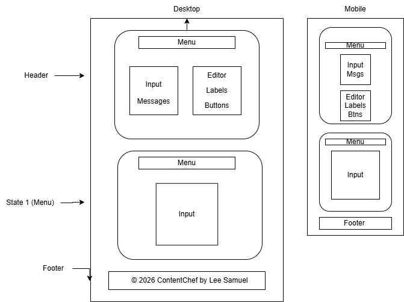
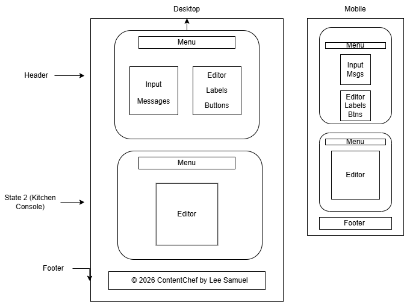
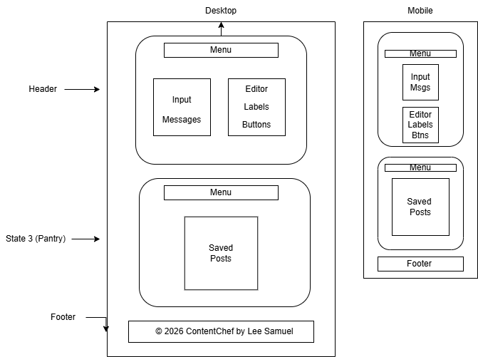

# Name

- Lee Samuel

# Project Name

- ContentChef

# Project 3 - ContentChef

- ContentChef is a simple React tool for business owners who need better marketing content fast. Use AI to "cook up" social media posts, check their quality with real-time stats, and save your favorites to a library to edit or delete later.

# User Stories

## 1 - As a small business owner

- I want to input a topic and select a content category
- So that the app can generate a professional draft for me using an API

### Acceptance Criteria:

- The user can enter a topic into a text input and select a category (e.g., "Sales" or "Education") from a dropdown menu.

- The "Generate" button remains disabled until the topic field is filled out.

- Upon clicking "Generate," the app fetches text from an external API (like OpenAI) to populate the draft.

- A loading indicator appears on the screen while the API request is in progress.

## 2 - As a user reviewing and editing content

- I want to edit the generated text manually and see a quality score
- So that I can ensure the content meets my standards

### Acceptance Criteria:

- The generated text is displayed in an editable text area where the user can add or delete words.

- The app displays a "Nutrition Label" box that shows a simple "Quality Score" or word count that updates as the user types.

- The app displays a relevant image fetched from an API (like Unsplash) based on the user's chosen topic.

- All changes to the text are tracked in the app's local state

## 3 - As a user managing the content library

- I want to save my drafts to a list and delete the ones I no longer need
- So that I can manage my content production pipeline

### Acceptance Criteria:

- A "Save" button allows the user to add the current draft and its details to a "Saved Posts" list.

- The "Library" view displays all saved posts, showing the title and the date they were created.

- Each item in the library has a "Delete" button that removes it from the list and the view immediately.

- The user can click a "Clear All" button to empty the entire library at once.

# Wireframe Diagrams

- 

- 

- 

# Technologies Used

- React (v19.2)
- Vite
- JavaScript (ES6+)
- Hooks (useState, useEffect)
- CSS3
- Git & GitHub

# Ideas for Improvement

1. OpenAI/Gemini API Integration - Actually connect the "Chef" to an AI to generate the social media copy.

2. Drag-and-Drop Library - Allow users to reorder their "cooked" content in their saved library.

3. Export to Social - Add a "Share" button that formats the content specifically for Facebook, Instagram, X, or LinkedIn.

4. Dark Mode: A "Night Kitchen" mode for late-night content creation.
